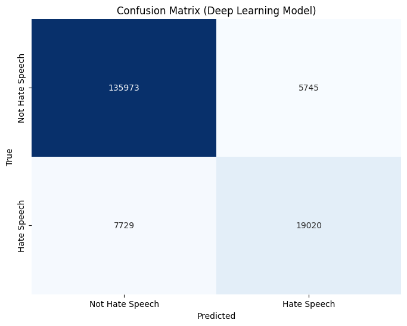
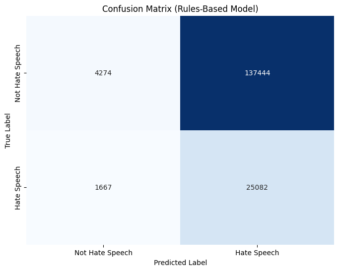
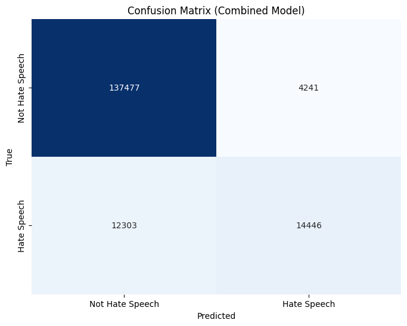

# ADL-Content Moderation
### For Applied Deep Learning-COMP-6710-01
### By: Brian Zschau

We will be using the dataset found [here](https://data.mendeley.com/datasets/9sxpkmm8xn/1).

Rules for rules-based model can be found [here](https://github.com/ChrisIsKing/Rule-By-Example/tree/main/data/rulesets).

In this project we will be implementing a multiple models to see what works to identify hate speech in online content. We will be implementing a neural network, a rules-based model, and a dual architecture model that combines the two.


## Instructions
Tested with Python 3.9 using Miniconda

To install the necessary packages run
```
pip install -r requirements.txt
```

In addition install [tensorflow](https://www.tensorflow.org/install)

## Data Processing
To prepare the dataset I followed the following steps:
1. Remove multiple spaces, hyperlinks, user mentions, emojis, and emoticons converted to text, and removed new line characters
2. Removing date and time values
3. Removing accented numbers and characters (e.g., ^ea, or ^12)
4. The remaining numbers are converted to words
5. Removing ampersands from the beginning of words
6. Removing the following characters (_"\-;%()|+&=*%.,!?`:#$@[]/) from the text

## Results

### Deep Learning
Deep Learning Accuracy = 0.92  
F1-Score = 0.74  


### Rules-Based Model
Rules-Based Accuracy = 0.17  
F1-Score = 0.27  


### Dual Architecture Model
Dual Architecture Accuracy = 0.90  
F1-Score = 0.64  


### Results

| Model             | Accuracy | F1-Score|
|-------------------|----------|---------|
| Deep Learning     | 0.92     | 0.74    |
| Rules Based Model | 0.17     | 0.27    |
| Dual Architecture | 0.90     | 0.64    |

The Dual Architecture model had slightly worse accuracy so in this implementation I would stick with the Deep Learning model. Rules Based Models have poor accuracy so I would recommend going with a differnet option.